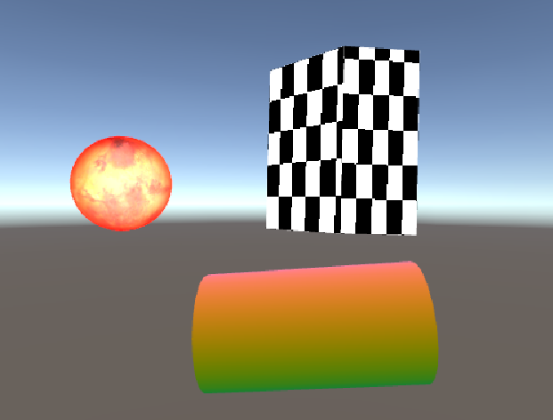
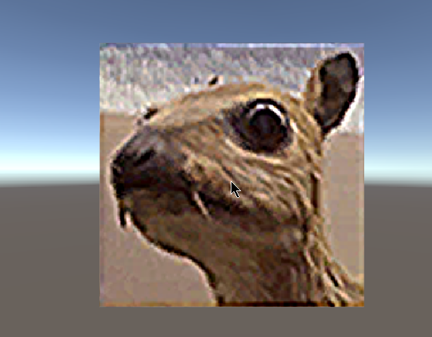
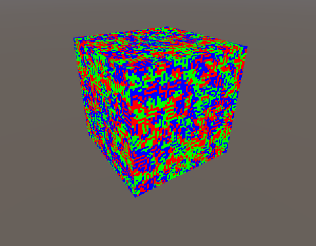

### Lighting, Image Processing, and Cellular Automata

Created for course CMPM 163 at UC Santa Cruz

**Professor:** Angus Forbes

**Course:** Game Graphics and Real-time Rendering

### Description

- Part A.  Created a 3D scene with 3 objects, each with different shaders. The sphere uses the Phong lighting model shader, along with a texture and vertex displacement shader. The cylinder has a rotational matrix displacement shader and the rectangle has a procedural texture and vertex displacement shader.
- Part B.  Created a fragment shader that takes an image and applies an image processing algorithm to it. The plane shape uses a filter kernel from the [wiki](https://en.wikipedia.org/wiki/Kernel_(image_processing)). Mouse movement changes the amount of sharpness on the texture.
- Part C.  Created a multi-color cellular automata. The cube has a cyclic cellular automata rule with 3 states/colors and uses Moore's neighbourhood to check neighbouring cells.

### WebGL Links

- Part A. [Shader Intro](https://wchunl.github.io/GraphicsRenderingUnity/asg1/Hw1-A/index.html)
- Part B. [Image Processing](https://wchunl.github.io/GraphicsRenderingUnity/asg1/Hw1-B/index.html). Move mouse to change blur rate.

### Screenshots

A.

B.

C.

