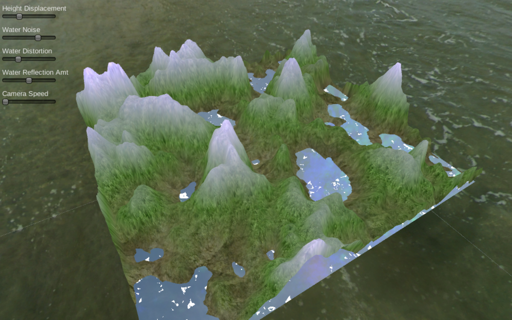

### Assignment 2 - Bloom, Heightmap, and Water Refraction

Created for course CMPM 163 at UC Santa Cruz

**Professor:** Angus Forbes

**Course:** Game Graphics and Real-time Rendering

### Description

- Part A.  Created a 3D scene with a character model which has an outline shader applied to it. The second shader is a screen-space bloom filter that blurs and brightens the scene. Phong lighting model is also used here.
- Part B.  Created an outdoor 3D scene with a cubemap. The quad in the scene uses a height map from a noise function to generate a mountainous terrain. A simple plane of water is added which reflects the sky.

### Links/Downloads

- Part A. [Source Code](https://github.com/wchunl/CM163/tree/master/asg2/Hw2-A_src) | [Executable](https://github.com/wchunl/CM163/tree/master/asg2/Hw2-A)
- Part B. [Source Code](https://github.com/wchunl/CM163/tree/master/asg2/Hw2-B_src) | [WebGL](https://wchunl.github.io/CM163/asg2/Hw2-B/index.html)

### Screenshots

A.

B.

