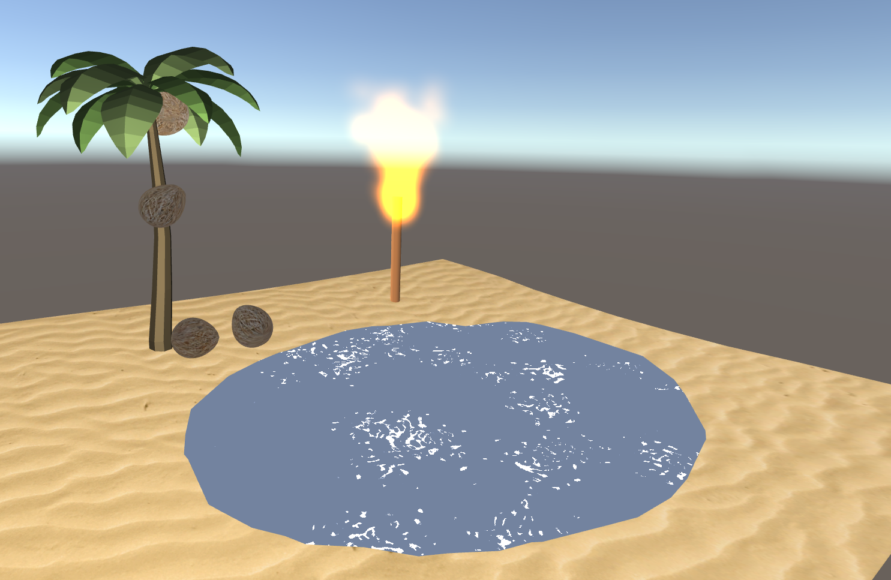

### Assignment 3 - Noise, Particles, and Sound

Created for course CMPM 163 at UC Santa Cruz

**Professor:** Angus Forbes

**Course:** Game Graphics and Real-time Rendering

### Description

- Part A.  Created a 3D oasis-like scene that has a tiki torch with fire particles that has a noise function, a palm tree model with coconuts that fall with respect to music beats, and water with distortion and noise filter.
- Part B.  Intial planning for the final project.

### Links/Downloads

- Part A. [Source Code](https://github.com/wchunl/CM163/tree/master/asg3/Hw3-A_src) | [Executable](https://github.com/wchunl/CM163/tree/master/asg3/Hw3-A)
- Part B. [PDF](https://github.com/wchunl/CM163/tree/master/asg2/Hw3-B)

### Screenshots

A.

